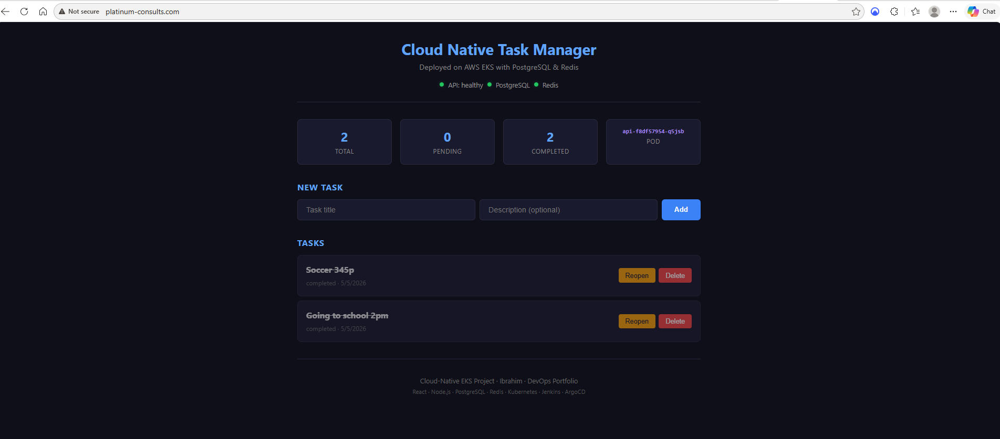
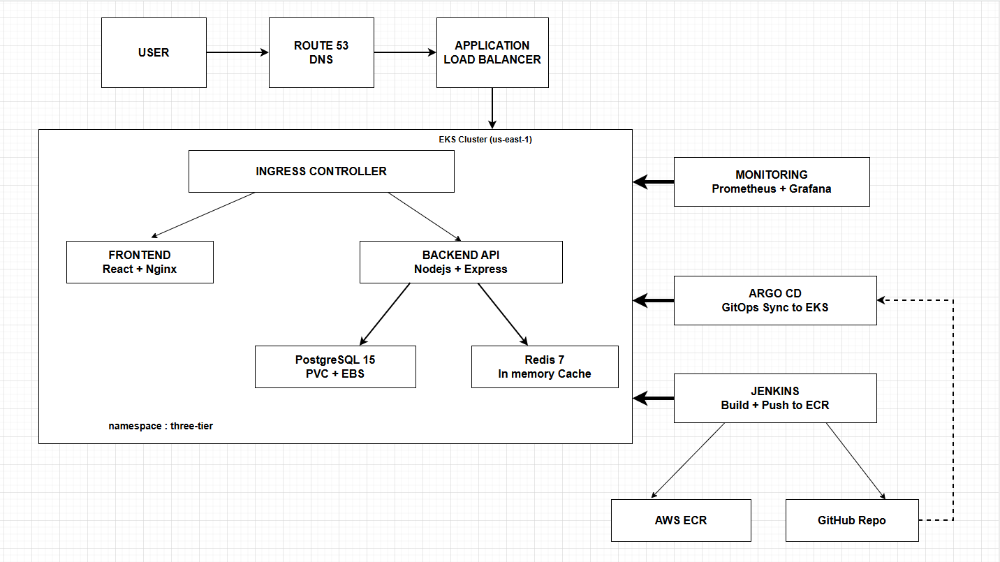
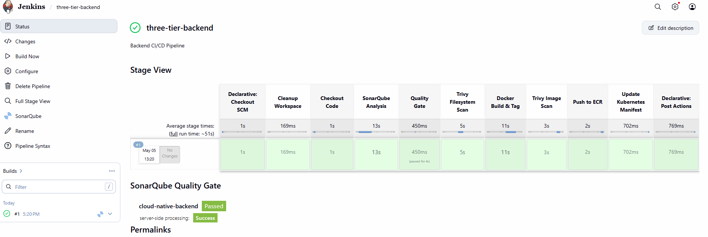
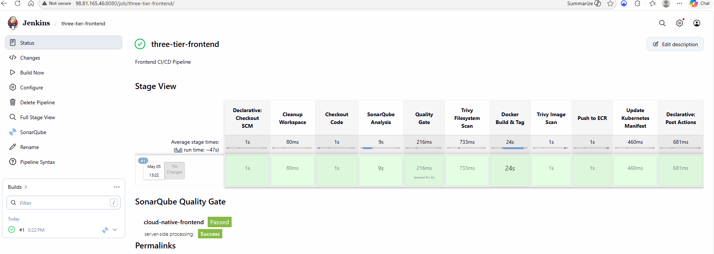
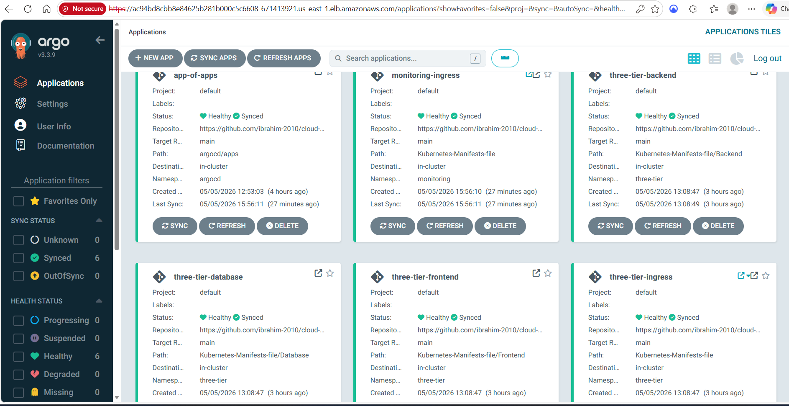
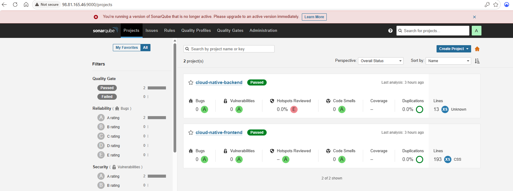
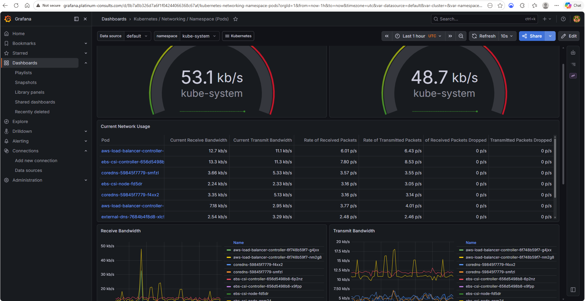
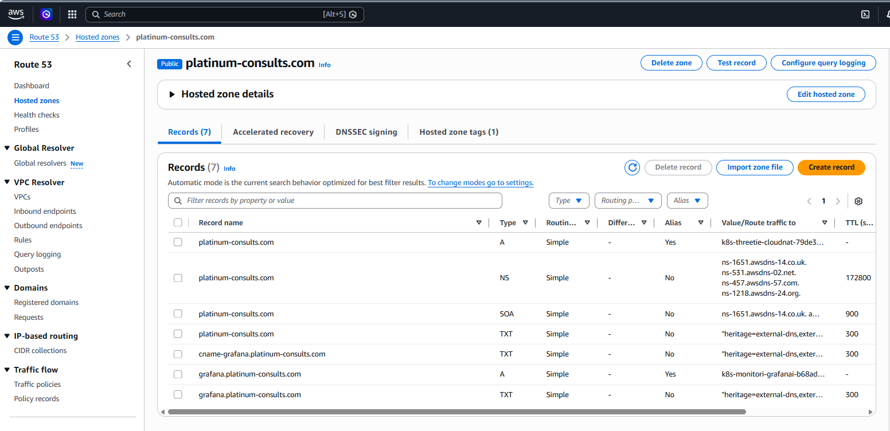

# Cloud-Native DevSecOps Three-Tier Application on AWS EKS 🚀

[](https://www.linkedin.com/in/ibrahim-jinadu-2388b73b8/)
[](https://github.com/ibrahim-2010)
[](http://platinum-consults.com)
[](http://grafana.platinum-consults.com)
 
[](https://aws.amazon.com)
[](https://kubernetes.io)
[](https://www.terraform.io)
[](https://www.jenkins.io)
[](https://argoproj.github.io/cd)
[](https://www.docker.com)

---

### 🌐 Live Deployment



---

Welcome to the Cloud-Native DevSecOps Three-Tier Application Deployment project! 🚀

This repository hosts the implementation of a **Three-Tier Web App** using **ReactJS**, **Node.js**, **PostgreSQL**, and **Redis**, deployed on **AWS EKS**. The entire platform is **Infrastructure as Code** — from bootstrap to teardown, every component is declarative and automated.

> ⚡ **Built across 4 deployment cycles. 17 production issues encountered and resolved.** Every fix is documented. This is not a tutorial follow-along.

---

## 📖 Project Overview

🛠️ **Infrastructure as Code — Everything Automated:**

- **Terraform** provisions Jenkins server, EKS cluster, VPC, ALB controller, EBS CSI driver, ExternalDNS, and Prometheus/Grafana monitoring
- **JCasC** (Jenkins Configuration as Code) auto-configures plugins, credentials, SonarQube, and pipeline jobs — zero UI clicking
- **ArgoCD App-of-Apps** pattern deploys all application components from a single `kubectl apply`
- **ExternalDNS** auto-creates Route 53 records from Ingress annotations
- **Bootstrap + Destroy scripts** for full lifecycle management

---

🚢 **The deployment covers:**

1. **Bootstrap** — S3, DynamoDB, ECR, key pair (one idempotent script)
2. **Jenkins Server** — Terraform + JCasC with 102 pre-installed plugins and automated SonarQube setup
3. **EKS Cluster** — Terraform creates VPC, cluster, node groups, OIDC, EBS CSI, ALB controller, ExternalDNS, and monitoring stack
4. **Application Deployment** — ArgoCD App-of-Apps deploys database, backend, frontend, ingress, and Grafana ingress
5. **CI/CD Pipeline** — 9-stage DevSecOps pipeline with SonarQube + Trivy + ECR + GitOps
6. **Teardown** — Ordered destroy script

---

## 🏗️ Architecture



---

## 📸 Deployment Evidence

### Jenkins CI/CD Pipelines — 9 Stages Green



### ArgoCD — All Apps Synced & Healthy


### SonarQube — Quality Gate Passed


### Grafana — Three-Tier Namespace Monitoring


### Route 53 — DNS Records Auto-Created by ExternalDNS


---

**CI/CD Flow:**
```
Code Push → Jenkins → SonarQube Analysis → Quality Gate → Trivy FS Scan
    → Docker Build → Trivy Image Scan → Push to ECR
    → Update K8s Manifest in Git → ArgoCD Auto-Deploy → EKS
```

**DNS Flow (Automated):**
```
Ingress Annotation → ExternalDNS → Route 53 A Record → ALB
platinum-consults.com         → App ALB
grafana.platinum-consults.com → Grafana ALB
```

---

## 🧰 Tech Stack

| Layer | Technology | Purpose |
|-------|-----------|---------|
| ☁️ **Cloud** | AWS (us-east-1) | EKS, ECR, ALB, Route 53, IAM, EBS, S3 |
| ⎈ **Orchestration** | Kubernetes (EKS) | Container orchestration, service discovery |
| ⚛️ **Frontend** | React + Nginx | SPA served via multi-stage Docker build (~25MB) |
| 🟢 **Backend** | Node.js + Express | REST API with health checks, CRUD, Redis caching |
| 🐘 **Database** | PostgreSQL 15 | Persistent storage with PVC on EBS |
| 🔴 **Cache** | Redis 7 Alpine | In-memory caching with TTL, LRU eviction |
| 🔧 **CI/CD** | Jenkins + JCasC | 9-stage automated DevSecOps pipeline, zero-click setup |
| 🔍 **Code Quality** | SonarQube | Static analysis, quality gates (auto-configured) |
| 🛡️ **Security** | Trivy | Filesystem + image vulnerability scanning |
| 🔄 **GitOps** | ArgoCD | App-of-Apps pattern, automatic deployment from Git |
| 📝 **IaC** | Terraform | Full stack — Jenkins, EKS, VPC, ALB, DNS, monitoring |
| 📊 **Monitoring** | Prometheus + Grafana | Metrics, dashboards, custom alerts (Terraform-managed) |
| 🌐 **DNS** | Route 53 + ExternalDNS | Automatic DNS from Ingress annotations |
| 📦 **Registry** | Amazon ECR | Private Docker image storage |
| 🚪 **Ingress** | AWS LB Controller | L7 load balancing, path-based routing |

---

## 📁 Repository Structure

```
cloud-native-eks/
├── 📂 Application-Code/
│   ├── 📂 backend/                    # Node.js Express API
│   │   ├── server.js                   # CRUD API + health checks + Redis caching
│   │   ├── Dockerfile                  # Alpine-based, non-root user, healthcheck
│   │   └── package.json
│   └── 📂 frontend/                   # React Single Page Application
│       ├── src/App.js                  # Task manager with live health indicators
│       ├── Dockerfile                  # Multi-stage build (Node → Nginx, ~25MB)
│       └── nginx.conf                  # SPA routing, security headers
├── 📂 EKS-Terraform/                  # ⭐ Full EKS IaC (replaces eksctl)
│   ├── main.tf                         # VPC, EKS cluster, node groups, OIDC
│   ├── ebs-csi.tf                      # EBS CSI driver addon + IRSA
│   ├── alb-controller.tf               # ALB controller IAM + IRSA
│   ├── helm-alb.tf                     # ALB controller Helm release
│   ├── helm-monitoring.tf              # Prometheus + Grafana Helm release
│   ├── external-dns-iam.tf             # ExternalDNS IAM + Route 53 hosted zone
│   ├── helm-external-dns.tf            # ExternalDNS Helm release
│   ├── namespaces.tf                   # three-tier, monitoring, argocd
│   ├── providers.tf                    # Kubernetes + Helm providers
│   ├── variables.tf                    # All configurable values
│   ├── outputs.tf                      # Cluster endpoint, kubectl command
│   └── backend.tf                      # S3 remote state
├── 📂 Jenkins-Server-TF/
│   ├── main.tf                         # EC2, SG, IAM role + EKS inline policy
│   ├── tools-install.sh                # 13 tools + 102 plugins pre-installed
│   └── 📂 jcasc/
│       ├── jenkins.yaml                # JCasC config
│       └── setup-jcasc.sh             # One-command secret injection
├── 📂 Jenkins-Pipeline-Code/
│   ├── Jenkinsfile-Backend             # 9-stage DevSecOps pipeline
│   └── Jenkinsfile-Frontend            # 9-stage DevSecOps pipeline
├── 📂 Kubernetes-Manifests-file/
│   ├── 📂 Database/
│   │   ├── postgres.yaml               # Secret + PVC + Deployment + Service
│   │   └── redis.yaml                  # Deployment + Service
│   ├── 📂 Backend/ & Frontend/
│   │   └── deployment.yaml             # Deployment + Service
│   ├── ingress.yaml                    # ALB + ExternalDNS annotation
│   ├── grafana-ingress.yaml            # Grafana ALB + ExternalDNS subdomain
│   └── monitoring-alerts.yaml          # Custom PrometheusRule (5 alerts)
├── 📂 argocd/
│   ├── app-of-apps.yaml                # ⭐ Root app (one kubectl apply)
│   └── 📂 apps/                       # Child apps auto-created
├── 📂 assets/
│   ├── architecture.png                # Architecture diagram
│   ├── app-live.png                    # Live app screenshot
│   ├── argocd-dashboard.png            # ArgoCD all apps synced
│   ├── grafana-dashboard.png           # Grafana three-tier metrics
│   ├── jenkins-pipelines-backend.png   # Backend pipeline 9 stages green
│   ├── jenkins-pipelines-frontend.png  # Frontend pipeline 9 stages green
│   ├── route53-records.png             # ExternalDNS auto-created records
│   └── sonarqube-quality-gate.png      # Both projects passed
├── 📂 docs/
│   ├── DEPLOYMENT-GUIDE.md
│   └── ISSUES-REPORT.md
├── bootstrap.sh                        # ⭐ One-command prerequisite setup
├── destroy.sh                          # ⭐ Ordered teardown script
└── README.md
```

---

## ✅ Prerequisites

- AWS Account with IAM user
- AWS CLI v2 configured
- Terraform >= 1.9.0
- **vCPU quota ≥ 20**
- Git & GitHub account with PAT
- Domain name with ability to change nameservers

---

## 🚀 Deployment Guide (5 Commands)

```bash
# 1. Bootstrap
bash bootstrap.sh

# 2. Deploy Jenkins
cd Jenkins-Server-TF && terraform init && terraform apply -auto-approve

# 3. Setup Jenkins (one interactive command)
ssh -i test.pem ubuntu@<jenkins-ip>
sudo bash /opt/setup-jcasc.sh

# 4. Deploy EKS + everything
cd EKS-Terraform && terraform init && terraform apply -auto-approve

# 5. Deploy apps
kubectl apply -f argocd/app-of-apps.yaml
```

> 📖 **[Full Deployment Guide](docs/DEPLOYMENT-GUIDE.md)** | ⚠️ **[Issues Report](docs/ISSUES-REPORT.md)**

---

## 🔄 CI/CD Pipeline Stages

| # | Stage | Tool | Purpose |
|---|-------|------|---------|
| 1 | 🧹 Cleanup | Jenkins | Fresh workspace |
| 2 | 📥 Checkout | Git | Clone repo |
| 3 | 🔍 SonarQube | sonar-scanner | Code quality |
| 4 | ✅ Quality Gate | SonarQube | Pass/fail |
| 5 | 🛡️ Trivy FS | Trivy | Source scan |
| 6 | 🐳 Docker Build | Docker | Build image |
| 7 | 🛡️ Trivy Image | Trivy | Image CVEs |
| 8 | 📤 Push ECR | AWS ECR | Private registry |
| 9 | 📝 Update Manifest | sed + git | Trigger ArgoCD |

---

## 📊 Monitoring & Alerts

| Component | Access |
|-----------|--------|
| Grafana | `grafana.platinum-consults.com` |
| Prometheus | Internal (ClusterIP) |
| Alertmanager | Internal (ClusterIP) |

| Alert | Severity |
|-------|----------|
| 🔴 PodDown | Critical |
| 🟡 HighCPUUsage | Warning |
| 🔴 PodCrashLooping | Critical |
| 🔴 PostgreSQLDown | Critical |
| 🔴 RedisDown | Critical |

---

## ⚠️ Challenges & Solutions

**17 issues** across 4 deployments — [Full Report](docs/ISSUES-REPORT.md)

| # | Challenge | Solution |
|---|-----------|----------|
| 1 | `eks:DescribeClusterVersions` denied | EKS inline policy in Terraform |
| 2 | Instance profile creds cached | Export credentials directly |
| 3 | `npm ci` build failure | `npm install --omit=dev` |
| 4 | ArgoCD CRD too large | `--server-side --force-conflicts` |
| 5 | ArgoCD overwrote pods | Push to Git before ArgoCD |
| 6 | Pods Pending (pod limit) | t3.xlarge (58 pods/node) |
| 7 | vCPU quota limit | Request increase to 20 |
| 8 | Quality Gate timeout | Webhook via private IP |
| 9 | SCM credential empty | Username with password type |
| 10 | sonar-scanner not found | jenkins-plugin-manager JAR |
| 11 | ALB not provisioning | Broader IAM in Terraform |
| 12 | ImagePullBackOff | sed regex to correct tags |
| 13 | Ingress ADDRESS empty | Delete and reapply |
| 14 | JCasC sonarGlobalConfiguration | Groovy init script |
| 15 | Plugin dependency hell | jenkins-plugin-manager JAR |
| 16 | SonarQube rejects localhost | Private IP for webhook |
| 17 | Grafana wrong datasource | Clean old configmaps, Terraform manages monitoring |

---

## 📈 Reports

### Automation Report

| Phase | Before | After |
|-------|--------|-------|
| Prerequisites | 6 CLI commands | `bash bootstrap.sh` |
| Jenkins | 15+ UI clicks | `terraform apply` + `setup-jcasc.sh` |
| EKS + networking | eksctl + 8 commands | `terraform apply` (41 resources) |
| Monitoring | Manual helm + config | Terraform Helm provider |
| DNS | Console clicking | ExternalDNS (automatic) |
| Apps | 3 ArgoCD UI forms | `kubectl apply -f app-of-apps.yaml` |
| Teardown | 8 commands | `bash destroy.sh` |

### Security Report

| Check | Tool | Result |
|-------|------|--------|
| Code Quality | SonarQube | ✅ Passed |
| Source CVEs | Trivy FS | ✅ Clean |
| Image CVEs | Trivy Image | ✅ Scanned |
| Secrets | JCasC + K8s Secrets | ✅ No hardcoded |
| IAM | IRSA per service | ✅ Least privilege |
| Database | ClusterIP | ✅ Not exposed |

---

## 🧹 Cleanup

```bash
bash destroy.sh
```

---

## 👤 Author

**Ibrahim** — DevOps Engineer

[](https://github.com/ibrahim-2010)
[](http://platinum-consults.com)
[](http://grafana.platinum-consults.com)

---

## 📄 License

MIT License — see [LICENSE](LICENSE) for details.

Happy Deploying! 🚀