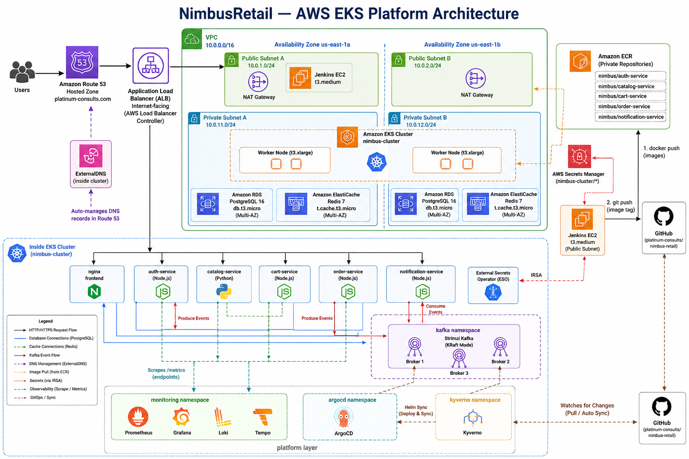

# NimbusRetail – Production-Grade Cloud-Native Platform on AWS EKS

[](https://www.linkedin.com/in/ibrahim-jinadu-2388b73b8/)
[](https://github.com/ibrahim-2010/nimbus-retail-platform)
[](http://platinum-consults.com)
[](http://grafana.platinum-consults.com)
[](http://prometheus.platinum-consults.com)

[](https://aws.amazon.com/eks/)
[](https://www.terraform.io)
[](https://argoproj.github.io/cd)
[](https://www.jenkins.io)
[](https://strimzi.io)
[](https://kyverno.io)
[](https://prometheus.io)
[](https://grafana.com)

---

## Overview

NimbusRetail is a **fully automated, production-grade cloud-native e-commerce platform** deployed on AWS EKS. Five microservices (Node.js + Python) communicate synchronously over HTTP and asynchronously through Apache Kafka, backed by managed RDS PostgreSQL and ElastiCache Redis.

The project was built to reflect how a real platform engineering team operates: **every component is automated, every credential is generated and stored securely, every architectural decision is documented, and every production issue encountered is fully resolved and written up.**

The entire stack – VPC, EKS cluster, RDS, Redis, Kafka, ArgoCD, Prometheus, Grafana, Loki, Tempo, Kyverno, ESO – deploys from a single Jenkins pipeline with zero manual Kubernetes or AWS steps after initial setup.

> **16 real production issues** encountered and resolved across deployment cycles. Every root cause and fix is documented in [`docs/ISSUES-REPORT.md`](docs/ISSUES-REPORT.md) – not a tutorial, not a happy path.

---

## Architecture



---

## Platform Engineering Skills Demonstrated

This project was built to reflect production platform engineering practices – not a guided tutorial, but a ground-up implementation of what a real platform team delivers.

### Infrastructure as Code
- **40+ Terraform resources** across two workspaces (EKS platform + Jenkins server)
- Modular file structure – one `.tf` file per concern (`rds.tf`, `helm-eso.tf`, `irsa-nimbus.tf`, etc.)
- Remote state in S3 with DynamoDB locking – safe for team use
- `nimbus.tfvars` committed via explicit `.gitignore` exception – no state drift between runs

### GitOps – ArgoCD App-of-Apps
- Single `kubectl apply -f argocd/app-of-apps.yaml` bootstraps **11 child applications**
- ArgoCD watches `argocd/apps/` – adding a new app is a single YAML file, no manual steps
- Every service, security policy, and monitoring rule is declared in Git and auto-synced

### CI/CD – Fully Automated DevSecOps Pipeline
- **Jenkins configured entirely via JCasC** (Configuration as Code) – zero manual UI setup
- `setup-jcasc.sh` provisions credentials, SonarQube, webhooks, and 6 pipeline jobs in one command
- Every service build: SonarQube analysis → Quality Gate → Trivy FS scan → Docker build → Trivy image scan → ECR push → Helm values update → ArgoCD rollout
- No human touches the cluster after Step 3 of the initial bootstrap

### Secret Management – Zero Hardcoded Credentials
- **RDS and Grafana passwords** generated via Terraform `random_password` – unique per deployment, never in Git
- All credentials stored in **AWS Secrets Manager** under `nimbus-cluster/*`
- **ESO** syncs secrets from Secrets Manager into Kubernetes Secrets at pod startup – no plaintext in manifests
- IRSA scopes ESO's AWS access to `nimbus-cluster/*` only – no wildcard permissions

### Security – Defence in Depth
- **IRSA** (IAM Roles for Service Accounts) – every pod has its own AWS identity via OIDC, no shared node credentials
- **Kyverno** admission controller – enforces CPU/memory limits on all pods, blocks privileged containers
- **NetworkPolicies** – default-deny-all in `nimbus` namespace, explicit allow rules per service
- **Trivy** – CVE scanning on both the filesystem and the built Docker image in every pipeline run
- **SonarQube** quality gate – blocks deployment if code quality thresholds are not met

### Cost Engineering
- **Strimzi Kafka** (in-cluster, free) over AWS MSK (~$0.21/hr minimum = ~$150/month) – saves **~$450/month** at 3-broker scale
- **Loki** over AWS CloudWatch – CloudWatch charges per GB ingested and stored; Loki runs in-cluster at no additional cost
- Total platform cost: **~$0.51/hr** while running – well within a reasonable demo budget

### Observability – Four Pillars
- **Metrics**: Prometheus with `kube-prometheus-stack`, ServiceMonitor CRs scraping all 5 services
- **Dashboards**: Grafana with Prometheus, Loki, and Tempo datasources
- **Logs**: Loki + Promtail DaemonSet – no SDK changes needed in application code
- **Traces**: Tempo deployed and ready for OTLP instrumentation
- **Alerts**: 5 PrometheusRule alerts – PodDown, HighCPU, CrashLooping, HighErrorRate, KafkaConsumerLag

### Documentation Standards
- **SDD** (System Design Document) with full AWS architecture diagram
- **5 Architecture Decision Records** – every major technology choice is justified with alternatives considered
- **Operational Runbook** – 11 day-2 procedures (rollback, scale, rotate secrets, investigate lag)
- **Issues Report** – 16 production issues documented with root cause, fix, and lesson learned
- **Deployment Guide** – step-by-step with secret management strategy and credential rotation

---

## Tech Stack

| Layer | Technology | Detail |
|---|---|---|
| **Cloud** | AWS us-east-1 | EKS 1.31, RDS PostgreSQL 16, ElastiCache Redis 7, ECR, ALB, Route 53, Secrets Manager |
| **Orchestration** | Kubernetes (EKS) | 2 × t3.xlarge nodes, OIDC provider, IRSA per service account |
| **IaC** | Terraform | 40+ resources – VPC, EKS, RDS, Redis, Helm releases, IAM, namespaces |
| **GitOps** | ArgoCD | App-of-Apps pattern – 11 child apps, one `kubectl apply` bootstraps everything |
| **CI/CD** | Jenkins + JCasC | 6 pipelines, zero-click setup, fully declarative configuration |
| **Messaging** | Strimzi Kafka | KRaft mode (no ZooKeeper), 3 brokers, gp3 EBS PVCs, in-cluster |
| **Services** | Node.js + Python | auth/cart/order/notification (Express), catalog (FastAPI) |
| **Frontend** | nginx | Static HTML/JS, ALB Ingress, custom `/healthz` endpoint |
| **Secrets** | ESO + Secrets Manager | Runtime injection – zero plaintext in Git or manifests |
| **Policy** | Kyverno | 2 enforce + 2 audit policies – resource limits, image tags, labels |
| **Metrics** | Prometheus | kube-prometheus-stack, ServiceMonitor CRs per service |
| **Dashboards** | Grafana | Live at `grafana.platinum-consults.com`, password in Secrets Manager |
| **Logs** | Loki + Promtail | DaemonSet log shipping, Grafana datasource |
| **Traces** | Tempo | OTLP-ready, Grafana datasource |
| **DNS** | ExternalDNS + Route 53 | Fully automated – Ingress annotations create A records |
| **Ingress** | AWS Load Balancer Controller | ALB, path-based routing, IP target mode, shared ALB group |
| **Scanning** | Trivy + SonarQube | CVE scanning + code quality gates on every build |
| **Storage** | EBS CSI (gp3) | Default cluster StorageClass, encrypted at rest |

---

## Services

| Service | Language | Port | Responsibilities |
|---|---|---|---|
| **auth-service** | Node.js / Express | 3001 | Registration, login, JWT issuance, Kafka producer (`users.registered`) |
| **catalog-service** | Python / FastAPI | 3002 | Product listing, inventory, Redis caching |
| **cart-service** | Node.js / Express | 3003 | Shopping cart (JSONB in PostgreSQL), Redis caching |
| **order-service** | Node.js / Express | 3004 | Order creation, Kafka producer (`orders.created`) |
| **notification-service** | Node.js | 3005 | Kafka consumer – processes `users.registered` + `orders.created` |
| **frontend** | nginx | 80 | Static UI – register, browse, add to cart, place order |

All backend services expose `/healthz`, `/readyz`, and `/metrics` (Prometheus format).

---

## Security – Defence in Depth

| Layer | Control | Detail |
|---|---|---|
| **Credentials** | Generated passwords | `random_password` resource – unique RDS + Grafana password per deployment |
| **Secret storage** | AWS Secrets Manager | `nimbus-cluster/*` – zero plaintext in Git, Terraform state, or CI logs |
| **Secret injection** | External Secrets Operator | Pulls from Secrets Manager into K8s Secrets at runtime via IRSA |
| **AWS identity** | IRSA (per service account) | Pod-level IAM via OIDC – no shared node credentials, no long-lived keys |
| **Admission control** | Kyverno | Enforce: resource limits, no privileged containers. Audit: latest tag, app label |
| **Network isolation** | Kubernetes NetworkPolicies | Default-deny-all in `nimbus` namespace – 7 explicit allow rules per service |
| **Database** | RDS SSL | All connections use `sslmode=require` – RDS rejects unencrypted connections |
| **Image security** | Trivy (FS + image) | CVE scan on source filesystem AND built image – blocks pipeline on critical findings |
| **Code quality** | SonarQube quality gate | Static analysis blocks deployment on quality threshold failures |
| **IAM** | Least privilege | Jenkins IAM role scoped to required services; inline policy for EKS + RDS |
| **Network perimeter** | Private subnets | RDS and ElastiCache unreachable from internet – only EKS worker nodes can connect |

---

## CI/CD Pipeline

```
Developer pushes to nimbus-retail-starter (app repo)
    │
    ▼
Jenkins – nimbus-<service>-service job
    │
    ├─ Stage 1:  Cleanup workspace
    ├─ Stage 2:  Git checkout (app repo)
    ├─ Stage 3:  SonarQube static analysis
    ├─ Stage 4:  Quality Gate  ── BLOCKS if thresholds not met
    ├─ Stage 5:  Trivy filesystem scan
    ├─ Stage 6:  Docker build
    ├─ Stage 7:  Trivy image scan
    ├─ Stage 8:  Push to ECR  (022374769206.dkr.ecr.us-east-1.amazonaws.com/nimbus/<svc>)
    └─ Stage 9:  Clone platform repo → update image tag in Helm values → git push
                    │
                    ▼
             ArgoCD detects Git change (polls every 3 min)
                    │
                    ▼
             Helm rolling update on EKS – zero-downtime deployment
```

**Infrastructure pipeline** (`nimbus-infrastructure`) deploys the full stack in 9 automated stages:
Bootstrap → Terraform EKS cluster → Terraform full stack → Configure kubectl → Populate Secrets Manager → Install ArgoCD → Deploy App-of-Apps → Initialize Database → Print all access URLs.

**Jenkins itself** is configured via JCasC (`jenkins.yaml` + `setup-jcasc.sh`) – credentials, SonarQube, webhooks, and all 6 pipeline jobs are provisioned from a single script. No manual UI configuration.

---

## Observability

| Signal | Tool | Where to view |
|---|---|---|
| **Metrics** | Prometheus + kube-prometheus-stack | `prometheus.platinum-consults.com` |
| **Dashboards** | Grafana | `grafana.platinum-consults.com` |
| **Logs** | Loki + Promtail DaemonSet | Grafana → Explore → Loki datasource |
| **Traces** | Tempo (OTLP-ready) | Grafana → Explore → Tempo datasource |
| **Alerts** | PrometheusRule CRs | PodDown · HighCPUUsage · PodCrashLooping · HighErrorRate · KafkaConsumerLag |
| **ServiceMonitors** | ServiceMonitor CRs | Scrapes `/metrics` from all 5 nimbus services every 30s |

---

## Architecture Decision Records

Every major technology choice is documented with the alternative considered and the reason for the decision. See [`docs/ADRs/`](docs/ADRs/) for full context.

| ADR | Decision | Alternative | Reason |
|---|---|---|---|
| [ADR-001](docs/ADRs/ADR-001-strimzi-over-msk.md) | Strimzi Kafka (in-cluster) | AWS MSK | MSK minimum cost ~$0.21/hr (~$150/mo); Strimzi is free and CNCF-graduated |
| [ADR-002](docs/ADRs/ADR-002-shared-helm-chart.md) | Single shared Helm chart | One chart per service | Eliminates duplication; per-service values files provide full customisation |
| [ADR-003](docs/ADRs/ADR-003-external-secrets-operator.md) | ESO + Secrets Manager | K8s Secrets in Git | Zero secrets in version control; IRSA-scoped access; supports rotation |
| [ADR-004](docs/ADRs/ADR-004-kyverno-admission-control.md) | Kyverno | OPA/Gatekeeper | Kubernetes-native CRDs; simpler policy authoring than Rego |
| [ADR-005](docs/ADRs/ADR-005-loki-over-cloudwatch.md) | Loki | AWS CloudWatch | CloudWatch charges per GB ingested and stored; Loki integrates natively with Grafana |

---

## Key Engineering Challenges

**16 production issues resolved** across multiple deployment cycles. This is not a tutorial – these are real failures with real debugging and real fixes. Full report: [`docs/ISSUES-REPORT.md`](docs/ISSUES-REPORT.md).

| # | Issue | Root Cause | Fix | Lesson |
|---|---|---|---|---|
| 1 | Kubernetes provider → `localhost:80` | EKS endpoint empty at Terraform plan time | Two-stage `terraform apply` with `-target` | Provider config is evaluated before resources exist |
| 2 | Wrong cluster name deployed | `*.tfvars` gitignored | `!EKS-Terraform/nimbus.tfvars` exception | Jenkins clones from Git – if it's not there, it's not used |
| 3 | ESO namespace not found | `nimbus` NS created by ArgoCD, which ran after ESO | Added `kubernetes_namespace.nimbus` to Terraform | Terraform controls boot order; ArgoCD can't be relied on for bootstrap deps |
| 4 | Kafka PVCs unbound | No StorageClass in cluster | `gp3` StorageClass via EBS CSI Terraform module | EBS CSI driver ≠ StorageClass – they must be configured separately |
| 5 | All services 0/1 – SSL errors | RDS requires SSL; Node.js `pg` defaults to plaintext | `?sslmode=require` + `NODE_TLS_REJECT_UNAUTHORIZED=0` | Managed services enforce security; clients must be configured to match |
| 6 | Grafana CrashLoopBackOff | Multiple datasources configured as `isDefault: true` | `sidecar.datasources.isDefaultDatasource: false` | Helm chart defaults + manual config = conflict |
| 7 | ExternalDNS DNS conflict | Two ingresses claiming the same hostname | Removed `host` from legacy ingress spec | ExternalDNS reads `spec.rules[].host`, not just annotations |
| 8 | ALB 503 on all API calls | Health check path `/` not exposed by microservices | Changed to `/healthz` + nginx config update | ALB marks targets unhealthy if the health check path returns non-200 |
| 9 | Database schemas missing on RDS | `init-db.sql` only runs via Docker's `initdb` mechanism | psql Kubernetes Job in Jenkins pipeline | EKS has no equivalent to docker-compose `initdb` – must be explicit |
| 10 | Kyverno fails with 6 webhook errors | ALB controller not ready when Kyverno installed its Services | `depends_on = [helm_release.alb_controller]` | Admission webhooks fire immediately – dependent controllers must be ready first |
| 11 | ExternalSecret `v1beta1` error | Wrong API version in manifest | Changed to `v1` | ESO v1 dropped `v1beta1` – always check CRD API versions after upgrades |
| 12 | Only 2 of 6 Jenkins jobs created | `tools-install.sh` had stale inline JCasC out of sync with `jcasc/jenkins.yaml` | Removed inline JCasC; `tools-install.sh` now `wget`s `jcasc/jenkins.yaml` at boot | Two sources of truth will always drift – one file, one source |
| 13 | Orphan IAM roles block fresh deployment | Previous `terraform destroy` left EKS IAM roles behind | Added role cleanup loop to `destroy.sh` phase 9b fallback | Terraform state loss = orphan resources; destroy scripts must not rely on state alone |
| 14 | Kyverno blocked db-init Job | Job container had no resource limits – violated `require-resource-limits` policy | Added `requests` and `limits` to Job container spec | Enforce policies apply to ALL workloads including one-off Jobs |
| 15 | EKS nodes fail to join cluster (NodeCreationFailure) | NAT gateway not created before node group – nodes in private subnets had no outbound route | Added `aws_nat_gateway.main`, `aws_route_table.private`, `aws_route_table_association.private` to Stage 1 `-target` list | Nodes bootstrap by calling AWS APIs – private subnets need NAT before nodes launch |
| 16 | NodeCreationFailure persists after Issue 15 fix | Public route table missing IGW route – NAT gateway had no path to internet | Added `aws_route_table.public`, `aws_route_table_association.public` to Stage 1 `-target` list | NAT needs the full chain: private RT → NAT → public RT → IGW – all must exist before nodes boot |

---

## Repository Structure

```
nimbus-retail-platform/
│
├── Application-Code/               # Application source code
│   ├── backend/                    # Node.js Express API (auth, cart, order, notification)
│   │   ├── Dockerfile
│   │   ├── server.js
│   │   └── package.json
│   └── frontend/                   # nginx static UI
│       ├── Dockerfile
│       ├── nginx.conf
│       └── src/                    # React components
│
├── EKS-Terraform/                  # Full EKS platform – IaC
│   ├── main.tf                     # VPC, subnets, EKS cluster, node group, OIDC
│   ├── variables.tf                # Input variables (cluster name, region, instance types)
│   ├── outputs.tf                  # Cluster endpoint, RDS/Grafana secret ARNs, ECR URLs
│   ├── backend.tf                  # Remote state – S3 + DynamoDB
│   ├── rds.tf                      # RDS PostgreSQL 16 + random password + Secrets Manager
│   ├── elasticache.tf              # ElastiCache Redis 7
│   ├── ebs-csi.tf                  # EBS CSI driver + gp3 StorageClass (default)
│   ├── alb-controller.tf           # ALB controller IAM + IRSA
│   ├── helm-alb.tf                 # ALB controller Helm release
│   ├── helm-monitoring.tf          # Prometheus + Grafana + random password + Secrets Manager
│   ├── helm-eso.tf                 # External Secrets Operator
│   ├── helm-kyverno.tf             # Kyverno admission controller
│   ├── helm-strimzi.tf             # Strimzi Kafka operator
│   ├── helm-loki.tf                # Loki log aggregation
│   ├── helm-tempo.tf               # Tempo distributed tracing
│   ├── helm-external-dns.tf        # ExternalDNS + Route 53 integration
│   ├── external-dns-iam.tf         # ExternalDNS IAM role
│   ├── irsa-nimbus.tf              # IRSA role for ESO (scoped to nimbus-cluster/*)
│   ├── ecr.tf                      # 5 ECR repositories (nimbus/*)
│   ├── namespaces.tf               # Kubernetes namespaces (nimbus, monitoring, kafka, argocd)
│   └── nimbus.tfvars               # Cluster config (committed via .gitignore exception)
│
├── Jenkins-Server-TF/              # Jenkins EC2 – IaC
│   ├── main.tf                     # EC2, IAM role, inline policies, SG
│   ├── variables.tf                # Instance type, key name, volume size
│   ├── outputs.tf                  # Public IP, SSH command
│   ├── backend.tf                  # Remote state – S3 + DynamoDB
│   ├── tools-install.sh            # Jenkins, Docker, Terraform, kubectl, Trivy, SonarQube
│   └── jcasc/
│       ├── jenkins.yaml            # JCasC – credentials, SonarQube, 6 pipeline jobs
│       ├── setup-jcasc.sh          # One-command secret injection + SSH configuration
│       └── plugins.txt             # Jenkins plugin list
│
├── Jenkins-Pipeline-Code/
│   ├── Jenkinsfile-Infrastructure  # 9-stage pipeline: full EKS platform deployment
│   └── Jenkinsfile-Nimbus          # 9-stage DevSecOps: SonarQube → Trivy → ECR → ArgoCD
│
├── helm/nimbus-service/            # Shared Helm chart – all 5 services
│   ├── Chart.yaml
│   ├── templates/                  # Deployment, Service, HPA templates
│   ├── values.yaml                 # Base defaults
│   └── values-{auth,catalog,cart,order,notification}.yaml
│
├── Kubernetes-Manifests-file/
│   ├── Kafka/kafka-cluster.yaml    # Strimzi KafkaCluster CR (KRaft, 3 brokers, gp3)
│   ├── Nimbus-Frontend/            # nginx Deployment + ALB Ingress
│   ├── Namespace/nimbus-namespace.yaml
│   ├── Security/                   # ExternalSecret, SecretStore, NetworkPolicies, Kyverno policies
│   ├── Monitoring/                 # ServiceMonitor CRs, PrometheusRule alerts
│   ├── grafana-ingress.yaml        # ALB Ingress for Grafana + Prometheus (shared group)
│   └── monitoring-alerts.yaml      # PrometheusRule – nimbus namespace alerts
│
├── argocd/
│   ├── app-of-apps.yaml            # Root ArgoCD app – auto-discovers argocd/apps/
│   └── apps/                       # 11 child app manifests
│
├── docs/
│   ├── SDD.md                      # System Design Document + AWS architecture diagram
│   ├── DEPLOYMENT-GUIDE.md         # Full deployment walkthrough + secret management + rotation
│   ├── ISSUES-REPORT.md            # 16 production issues – root cause + fix + lesson
│   ├── RUNBOOK.md                  # Day-2 operations – rollback, scale, rotate, investigate
│   └── ADRs/                       # 5 Architecture Decision Records
│
├── assets/                         # Architecture diagram + live platform screenshots
├── .github/workflows/ci.yml        # GitHub Actions – YAML validation + Terraform validate
├── bootstrap.sh                    # Creates S3, DynamoDB, key pair – idempotent
├── destroy.sh                      # 11-phase ordered teardown, zero orphaned resources
└── README.md
```

---

## Deployment (5 Steps, ~45 min)

Everything after Step 3 runs from Jenkins – no local Terraform apply for EKS.

### Step 1 – Push to GitHub
```bash
cd nimbus-retail-platform
git add . && git commit -m "deploy" && git push origin main
```

### Step 2 – Bootstrap (~3 min)
```bash
bash bootstrap.sh
```
Creates S3 state bucket, DynamoDB lock table, EC2 key pair. Idempotent – safe to re-run.

### Step 3 – Deploy Jenkins Server (~5 min)
```bash
cd Jenkins-Server-TF && terraform init && terraform apply -auto-approve
terraform output jenkins_public_ip
```
```bash
ssh -i ../test.pem ubuntu@<JENKINS_IP>
sudo tail -f /var/log/tools-install.log  # wait for: Installation Complete
sudo bash /opt/setup-jcasc.sh            # injects secrets, creates 6 jobs
```

### Step 4 – Run Infrastructure Pipeline (~30 min)
`http://<JENKINS_IP>:8080` → **`nimbus-infrastructure`** → **Build Now**

The pipeline deploys the full stack and prints all access URLs on completion.

### Step 5 – Trigger Service Builds
Run all 5 in parallel – `nimbus-auth/catalog/cart/order/notification-service`.

Each build: SonarQube → Quality Gate → Trivy → Docker → ECR → Helm values → ArgoCD rollout.

---

## Platform Access

| Service | URL | Credentials |
|---|---|---|
| **NimbusRetail** | `http://platinum-consults.com` | – |
| **Grafana** | `http://grafana.platinum-consults.com` | admin / (Secrets Manager: `nimbus-cluster/grafana/admin-password`) |
| **Prometheus** | `http://prometheus.platinum-consults.com` | – |
| **ArgoCD** | `https://<lb>` (printed by pipeline) | admin / (printed by pipeline) |
| **Jenkins** | `http://<JENKINS_IP>:8080` | admin / your chosen password |
| **SonarQube** | `http://<JENKINS_IP>:9000` | admin / SonarAdmin2026! |

```bash
# Retrieve Grafana password any time
aws secretsmanager get-secret-value \
  --secret-id nimbus-cluster/grafana/admin-password \
  --query SecretString --output text --region us-east-1
```

---

## Verification

```bash
aws eks update-kubeconfig --name nimbus-cluster --region us-east-1

kubectl get nodes                            # 2 nodes Ready
kubectl get pods -n nimbus                   # 6 Running (5 services + frontend)
kubectl get pods -n kafka                    # 3 nimbus-kafka-dual-role-* Running
kubectl get pods -n monitoring               # prometheus, grafana, loki, tempo Running
kubectl get applications -n argocd           # all Synced + Healthy
kubectl get externalsecrets -n nimbus        # READY=True, STATUS=SecretSynced
kubectl get networkpolicies -n nimbus        # 7 policies
kubectl get clusterpolicies                  # 4 Kyverno policies
```

End-to-end smoke test:
1. `http://platinum-consults.com` → Register → Login → Load products → Add to cart → Place order
2. Check notification-service logs – Kafka delivers the order confirmation event

---

## Cost (~$0.51/hr while running)

| Resource | Type | $/hr |
|---|---|---|
| EKS control plane | – | $0.10 |
| Worker nodes × 2 | t3.xlarge | $0.33 |
| RDS PostgreSQL | db.t3.micro | $0.017 |
| ElastiCache Redis | cache.t3.micro | $0.017 |
| Jenkins EC2 | t3.medium | $0.042 |
| **Total** | | **~$0.51/hr** |

> Strimzi Kafka (in-cluster) saves ~$150/month vs AWS MSK at 3-broker scale.
> S3 + DynamoDB (Terraform state) < $0.01/month – preserved across deployments.

---

## Teardown

```bash
bash destroy.sh
```

11 ordered phases: ArgoCD apps → observability → security stack → ArgoCD → Kafka → application namespaces → Route 53 → ALBs + EBS → EKS (Terraform) → ECR → Jenkins. Final scan reports any remaining billable resources.

---

## Documentation

| Document | Content |
|---|---|
| [`docs/SDD.md`](docs/SDD.md) | System Design Document – full AWS architecture diagram |
| [`docs/DEPLOYMENT-GUIDE.md`](docs/DEPLOYMENT-GUIDE.md) | Step-by-step deployment, secret management strategy, credential rotation |
| [`docs/ISSUES-REPORT.md`](docs/ISSUES-REPORT.md) | 16 production issues – root cause, fix, and lesson for each |
| [`docs/RUNBOOK.md`](docs/RUNBOOK.md) | Day-2 operations – scaling, rollback, secret rotation, incident investigation |
| [`docs/ADRs/`](docs/ADRs/) | 5 Architecture Decision Records with alternatives and rationale |

---

## Author

**Ibrahim Jinadu** – Platform / DevOps Engineer

[](https://www.linkedin.com/in/ibrahim-jinadu-2388b73b8/)
[](https://github.com/ibrahim-2010)
[](http://platinum-consults.com)

---

## License

MIT License – see [LICENSE](LICENSE) for details.
