# NimbusRetail — Solution Design Document

**Project:** NimbusRetail Platform on AWS EKS
**Author:** Ibrahim Jinadu
**AWS Account:** 022374769206
**Region:** us-east-1
**Status:** Complete (Phases 1–7)

---

## 1. Executive Summary

NimbusRetail is a cloud-native e-commerce platform consisting of five microservices
deployed on Amazon EKS. The platform team is responsible for taking developer-provided
application code to production with the operational, observability, and security layers
a real platform team would build around it.

The platform delivers:
- **Zero-downtime deployments** via ArgoCD GitOps with Helm rolling updates
- **Automated CI/CD** with Jenkins — build, scan, push to ECR, update Helm values
- **Full observability** — Prometheus metrics, Loki logs, Tempo traces, Grafana dashboards
- **Zero-trust networking** — Kubernetes NetworkPolicies with default-deny in the application namespace
- **Secret management** — External Secrets Operator pulling from AWS Secrets Manager via IRSA
- **Admission control** — Kyverno blocking privileged containers and enforcing resource limits

---

## 2. System Overview

### 2.1 Application Services

| Service | Language | Port | Responsibilities |
|---|---|---|---|
| auth-service | Node.js / Express | 3001 | User registration, login, JWT issuance |
| catalog-service | Python / FastAPI | 3002 | Product listing, inventory |
| cart-service | Node.js / Express | 3003 | User cart management |
| order-service | Node.js / Express | 3004 | Order creation, Kafka producer |
| notification-service | Node.js | 3005 | Kafka consumer, mock email dispatch |

### 2.2 Communication Patterns

**Synchronous (HTTP):**
```
ALB → auth-service       (register, login)
ALB → catalog-service    (browse products)
ALB → cart-service       (manage cart)
ALB → order-service      (place order)
order-service → cart-service  (fetch cart at checkout)
```

**Asynchronous (Kafka):**
```
auth-service  → users.registered  → notification-service
order-service → orders.created    → notification-service
```

---

## 3. AWS Architecture

### 3.1 Architecture Diagram

```mermaid
flowchart TB
    subgraph Internet
        User([User / Browser])
        GH([GitHub\nApp + Platform Repos])
    end

    subgraph AWS["AWS us-east-1 (Account 022374769206)"]
        R53[Route 53\nplatinum-consults.com]
        ECR[ECR\nnimbus/* repos]
        SM[Secrets Manager\nnimbus-cluster/*]

        subgraph VPC["VPC 10.0.0.0/16"]
            subgraph PublicSubnets["Public Subnets (us-east-1a/b)"]
                ALB[Application\nLoad Balancer]
                NAT[NAT Gateway]
                JenkinsEC2[Jenkins EC2\nm7i-flex.large]
            end

            subgraph PrivateSubnets["Private Subnets (us-east-1a/b)"]
                subgraph EKS["EKS Cluster — nimbus-cluster (k8s 1.31)"]
                    subgraph NimbusNS["namespace: nimbus"]
                        Auth[auth-service]
                        Catalog[catalog-service]
                        Cart[cart-service]
                        Order[order-service]
                        Notify[notification-service]
                        ESO[External Secrets\nOperator]
                    end
                    subgraph KafkaNS["namespace: kafka"]
                        Kafka[Strimzi Kafka\n3 brokers KRaft]
                    end
                    subgraph MonitoringNS["namespace: monitoring"]
                        Prom[Prometheus]
                        Grafana[Grafana]
                        Loki[Loki + Promtail]
                        Tempo[Tempo]
                    end
                    subgraph KyvernoNS["namespace: kyverno"]
                        Kyverno[Kyverno]
                    end
                    subgraph ArgoCDNS["namespace: argocd"]
                        ArgoCD[ArgoCD]
                    end
                end
                RDS[(RDS PostgreSQL 16\ndb.t3.micro)]
                Redis[(ElastiCache Redis 7\ncache.t3.micro)]
            end
        end
    end

    User -->|HTTPS| R53
    R53 -->|A record\nExternalDNS| ALB
    ALB --> Auth & Catalog & Cart & Order
    Order -->|HTTP| Cart
    Auth & Order & Notify <-->|port 9092| Kafka
    Auth & Cart & Order & Catalog -->|port 5432| RDS
    Catalog & Cart -->|port 6379| Redis
    ESO -->|IRSA| SM
    SM -.->|synced secrets| Auth & Cart & Order & Catalog

    JenkinsEC2 -->|docker push| ECR
    JenkinsEC2 -->|git push image tag| GH
    GH -->|watched by| ArgoCD
    ArgoCD -->|Helm sync| NimbusNS & KafkaNS
    ECR -->|imagePull| Auth & Catalog & Cart & Order & Notify

    Prom -->|scrapes /metrics| Auth & Catalog & Cart & Order & Notify
    Loki -->|ships logs| Auth & Catalog & Cart & Order & Notify
```



### 3.2 Infrastructure Summary

| Resource | Configuration | Purpose |
|---|---|---|
| VPC | 10.0.0.0/16, 2 AZs | Network isolation |
| EKS | v1.31, 2 × t3.xlarge | Application runtime |
| RDS PostgreSQL | 16.3, db.t3.micro | Persistent storage (all services) |
| ElastiCache Redis | 7.1, cache.t3.micro | Caching (catalog), sessions (cart) |
| Strimzi Kafka | 3-broker KRaft, 20 Gi/broker | Async event streaming |
| ECR | 5 repos, image scanning | Container registry |
| ALB | Internet-facing | HTTP ingress |
| Jenkins EC2 | `Jenkins-Server-TF/` | CI/CD runtime |
| Secrets Manager | `nimbus-cluster/*` | Secret storage |

---

## 4. GitOps and CI/CD Pipeline

### 4.1 Repository Structure

| Repo | Contents | Audience |
|---|---|---|
| `nimbus-retail-starter` | 5 service source trees, docker-compose | Developers |
| `nimbus-retail-platform` | Terraform, Helm chart, ArgoCD apps, pipelines | Platform team |

### 4.2 CI Pipeline (Jenkins)

One parameterised `Jenkinsfile-Nimbus` handles all five services:

```
Cleanup → Checkout app repo → SonarQube analysis → Quality Gate
       → Trivy FS scan → Docker build → Trivy image scan
       → Push to ECR (:<BUILD_NUMBER> and :latest)
       → Clone platform repo → Update helm/nimbus-service/values-<name>.yaml
       → git push → ArgoCD detects → Helm sync → Rolling pod update
```

### 4.3 CD Flow (ArgoCD App-of-Apps)

```
argocd/app-of-apps.yaml          (applied once manually)
  └── argocd/apps/
        ├── nimbus-namespace.yaml
        ├── nimbus-kafka.yaml
        ├── nimbus-auth.yaml      ← helm/nimbus-service + values-auth.yaml
        ├── nimbus-catalog.yaml
        ├── nimbus-cart.yaml
        ├── nimbus-order.yaml
        ├── nimbus-notification.yaml
        ├── nimbus-monitoring.yaml
        └── nimbus-security.yaml
```

---

## 5. Helm Chart Design

A single chart (`helm/nimbus-service/`) serves all five services. Per-service
`values-<name>.yaml` files override ports, image repositories, environment
variables, and secret references. This avoids chart duplication while keeping
each service independently configurable.

Key templates:
- `deployment.yaml` — supports `env` (plain) and `envFromSecrets` (secret refs)
- `service.yaml` — ClusterIP with named port `http` (required by ServiceMonitor)
- `hpa.yaml` — optional HPA (disabled for notification-service — Kafka consumer)

---

## 6. Observability

### 6.1 Metrics

All services expose `/metrics` in Prometheus format using `prom-client` (Node.js)
and `prometheus-client` (Python). Prometheus scrapes them via `ServiceMonitor` CRs
every 30 seconds.

Key metrics tracked: HTTP request rate, p95 latency, error rate (5xx), pod restarts.

### 6.2 Logs

Promtail runs as a DaemonSet on every node, tailing all container log files and
shipping to Loki. No SDK changes required in the application services.

### 6.3 Traces

Tempo is deployed and ready to receive OTLP traces. Services require OpenTelemetry
SDK instrumentation to emit spans — this is a future enhancement.

### 6.4 Alerts

Seven `PrometheusRule` alerts defined (`Kubernetes-Manifests-file/Monitoring/nimbus-alerts.yaml`):
service availability, pod crash-looping, high error rate, high latency, CPU/memory
pressure, and Kafka consumer lag.

---

## 7. Security

### 7.1 Network Security

| Layer | Mechanism |
|---|---|
| AWS perimeter | Security groups on RDS, ElastiCache (allow only EKS cluster SG) |
| Pod-to-pod | 7 NetworkPolicies — default-deny-all with explicit allows |
| External traffic | ALB security group + WAF (future) |

### 7.2 Identity and Secrets

| Concern | Solution |
|---|---|
| AWS API access for ESO | IRSA role scoped to `nimbus-cluster/*` in Secrets Manager |
| Application secrets | External Secrets Operator syncs from Secrets Manager into K8s Secrets |
| Image integrity | Trivy scans on every build (FS + image), ECR image scanning on push |

### 7.3 Admission Control (Kyverno)

| Policy | Mode | Rule |
|---|---|---|
| `disallow-privileged-containers` | Enforce | No privileged pods |
| `require-resource-limits` | Enforce | CPU + memory limits on all containers |
| `disallow-latest-tag` | Audit | Flag `:latest` image tags |
| `require-app-label` | Audit | All pods must carry `app` label |

---

## 8. Technology Decisions

| Decision | Choice | Alternative considered | Rationale |
|---|---|---|---|
| Kafka | Strimzi (in-cluster) | Amazon MSK | MSK ~$450/month minimum; Strimzi is free and CNCF-graduated |
| Helm strategy | Single shared chart | One chart per service | Less duplication; per-service values files provide full customisation |
| Secret management | ESO + Secrets Manager | Manual kubectl secrets | Automated rotation, no plaintext in Git, IRSA for auditability |
| Admission control | Kyverno | OPA/Gatekeeper | Kubernetes-native CRDs, simpler policy authoring |
| Log aggregation | Loki + Promtail | AWS CloudWatch | Cost: Loki is free; CloudWatch charges per GB ingested and stored |

Full rationale for each decision: see `docs/ADRs/`.

---

## 9. Known Limitations and Future Work

| Item | Detail |
|---|---|
| Tempo instrumentation | Services need OpenTelemetry SDK to emit traces |
| Kyverno audit policies | `disallow-latest-tag` and `require-app-label` are in audit mode — switch to enforce once all workloads comply |
| Single NAT Gateway | Cost optimisation; adds risk — a single-AZ failure takes down all outbound traffic |
| RDS Multi-AZ | Disabled for cost; enable for production |
| TLS on Kafka | Strimzi uses PLAINTEXT — enable TLS in production |
| Alertmanager routing | Alerts fire to Alertmanager but no receiver (Slack/PagerDuty) is configured |
