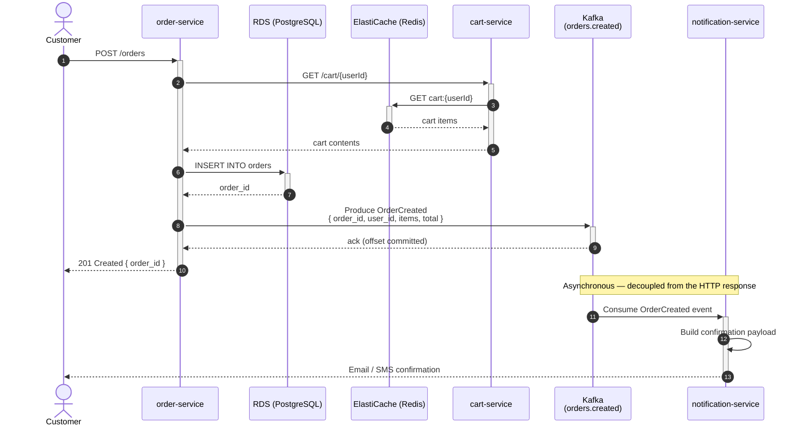

# OrderCreated Event Flow

Shows the asynchronous path from a customer placing an order to the confirmation notification being dispatched.

## Notes

- Steps 1–8 are synchronous and part of the HTTP request/response cycle. The customer receives a `201` as soon as the order is persisted and the Kafka produce is acknowledged.
- The notification dispatch (steps 9–11) is fully asynchronous. A Kafka produce failure does **not** fail the order — it is retried by Kafka's producer retry logic.
- `cart-service` is called synchronously to validate cart contents before the order is written to RDS.
- Consumer group for `notification-service` on this topic: `notification-service-group`.
- Topic: `orders.created` is auto-created on first produce (`auto.create.topics.enable: true`). Replication factor: 3. Partition count: Kafka default (1) unless a `KafkaTopic` resource is added to define it explicitly.
